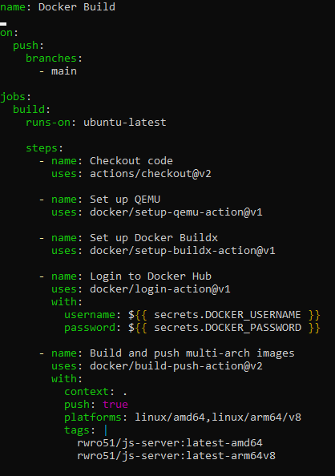
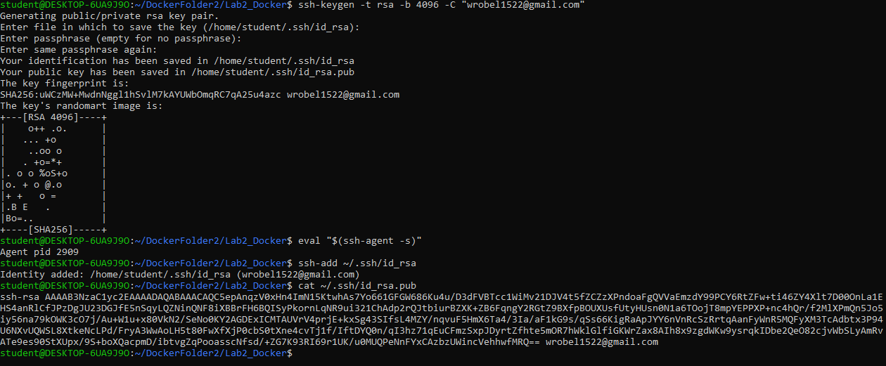
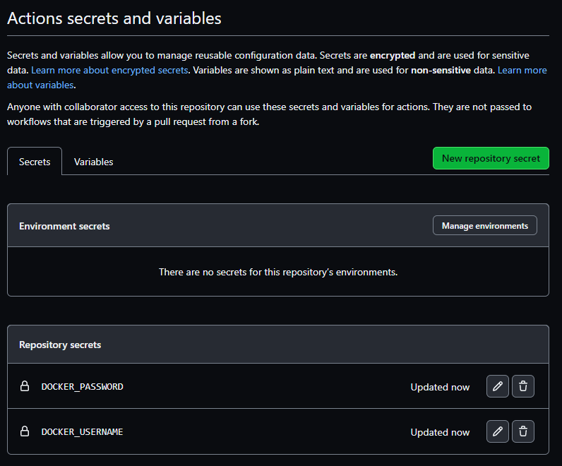
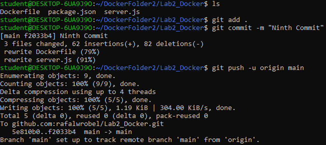
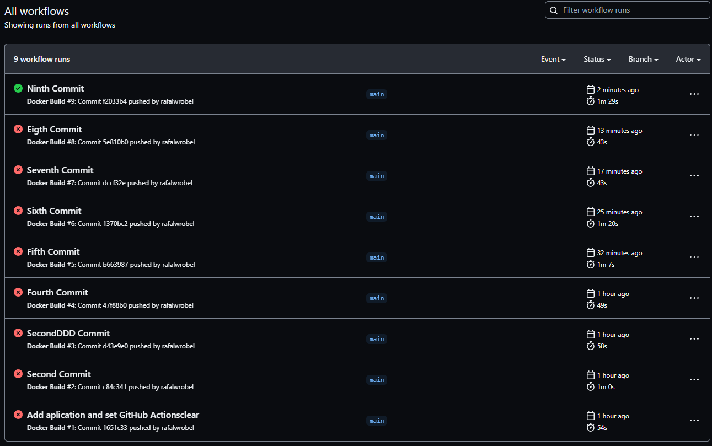

# **Sprawozdanie 2 - Rafał Wróbel**
Rozwiązania zadaia do sprawozdania 2  
Link do obrazu kontenera: [link](https://hub.docker.com/repository/docker/rwro51/js-server/general)

## **Zadanie 1**
Wykorzystując opracowaną aplikację (kod + Dockerfile) z zadania nr1 należy:
a. zbudować, uruchomić i potwierdzić poprawność działania łańcucha Github Actions, który zbuduje obrazy kontenera z tą aplikacją na architektury: linux/arm64/v8 oraz linux/amd64 wykorzystując QEMU 

Zrzut ekranu przedstawiający kod pliku docker-build.yml:  

Zrzut ekranu przedstawiający utworzenie łączności terminala z kontem GitHub:  

Zrzut ekranu przedstawiający utworzenie tajnych plików w repozytorium do zalogowania się na DockerHub:  

Zrzut ekranu konsoli z przesłania plików na GitHub:  

Zrzut ekranu przedstawiający wszystkie próby przesłania plików do repozytorium i utworzenia kontenera w DockerHub:  

Na powyższym zrzucie ekranu widać, że dopiero za dziewiątym razem udało się utworzyć obraz kontenera
